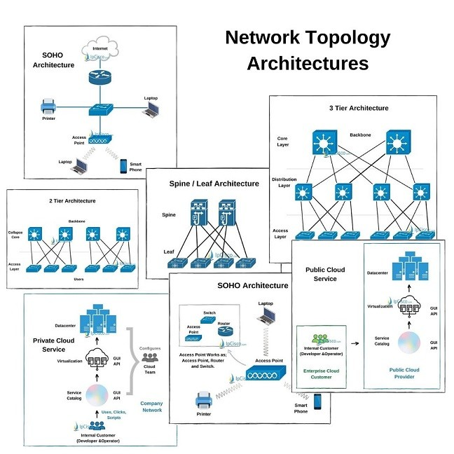
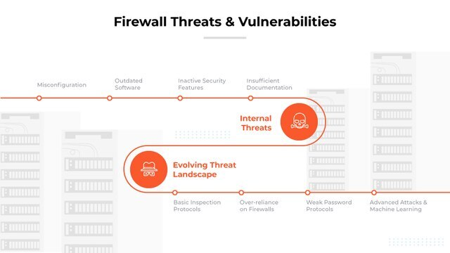
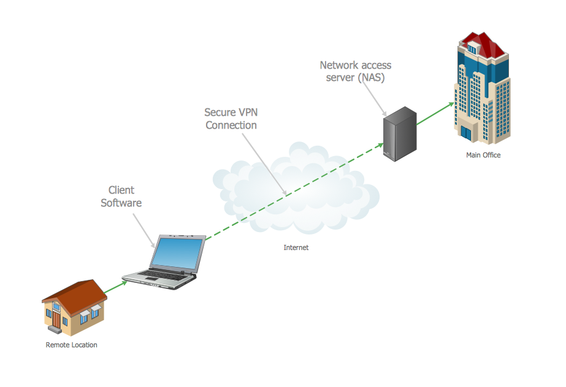
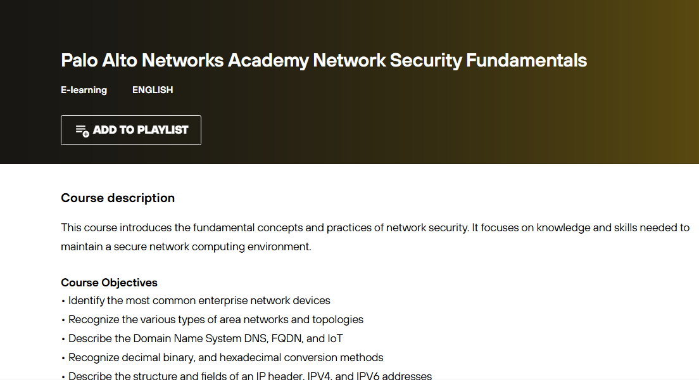
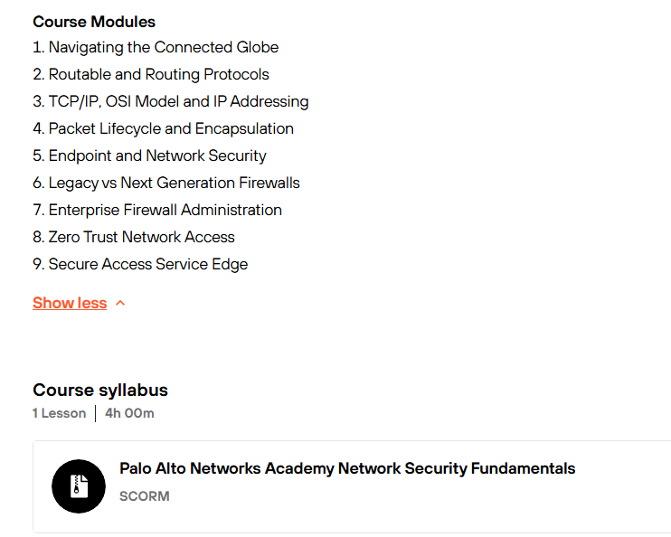

# 🛡️ Network Security Fundamentals – (Palo Alto)

This repository contains **notes, labs, images, extras, and the certificate of completion** for the *Network Security Fundamentals – Palo Alto* course. The program provides a solid foundation in **firewalls, VPNs, IPS, network monitoring, and security policies**.

---

## 📚 Notes
- 📄 [01-introduction-to-network-security.md](./notes/01-introduction-to-network-security.md) – Introduction to network security  
- 📄 [02-firewalls.md](./notes/02-firewalls.md) – Firewalls concepts and configuration  
- 📄 [03-intrusion-prevention.md](./notes/03-intrusion-prevention.md) – IPS fundamentals  
- 📄 [04-vpn-security.md](./notes/04-vpn-security.md) – VPN types & security  
- 📄 [05-network-segmentation.md](./notes/05-network-segmentation.md) – Network segmentation techniques  
- 📄 [06-traffic-monitoring.md](./notes/06-traffic-monitoring.md) – Traffic monitoring and anomaly detection  
- 📄 [07-security-policies.md](./notes/07-security-policies.md) – Security policies best practices  
- 📄 [08-threat-intelligence.md](./notes/08-threat-intelligence.md) – Threat intelligence integration  
- 📄 [09-cloud-network-security.md](./notes/09-cloud-network-security.md) – Cloud network security  
- 📄 [10-wireless-security.md](./notes/10-wireless-security.md) – Wireless network security  
- 📄 [11-network-hardening.md](./notes/11-network-hardening.md) – Hardening network devices  
- 📄 [12-incident-response.md](./notes/12-incident-response.md) – Incident response fundamentals  
- 📄 [13-compliance-standards.md](./notes/13-compliance-standards.md) – Compliance frameworks  
- 📄 [14-case-studies.md](./notes/14-case-studies.md) – Real-world network security cases  
- 📄 [15-final-assessment.md](./notes/15-final-assessment.md) – Final assessment exercises

---

## 🧪 Labs
- 💻 [hands-on-firewall.md](./labs/hands-on-firewall.md) – Firewall configuration lab  
- 💻 [vpn-setup-practice.md](./labs/vpn-setup-practice.md) – VPN setup lab  
- 💻 [intrusion-prevention-lab.md](./labs/intrusion-prevention-lab.md) – IPS lab exercise  
- 💻 [network-monitoring-exercises.md](./labs/network-monitoring-exercises.md) – Traffic monitoring lab

---

## 🔬 Extras
- 📄 [case-studies.md](./extras/case-studies.md) – Network security case studies  
- 📄 [resources.md](./extras/resources.md) – Reference materials  
- 📄 [timeline.md](./extras/timeline.md) – Security evolution timeline

---

## 🖼️ Images

| Topic                      | Image |
|-----------------------------|-------|
| Network Architecture        |  |
| Firewall Rule Flow          |  |
| VPN Connection Diagram      |  |

---

## 📸 Screenshots

| Section               | Screenshot |
|-----------------------|------------|
| Course Description    |  |
| Modules & Syllabus    |  |

---

## 📜 Certificate
🎓 [Network Security Fundamentals Paloalto](./cert/Network%20Security%20Fundamentals%20Paloalto.png)

---

## 📝 Personal Review
This course strengthened my **network security knowledge** in firewalls, VPNs, IPS, monitoring, and policies. The hands-on labs provided practical skills for real-world network defense and monitoring. Highly recommended for anyone looking to **build foundational expertise in network security operations**.

---

## ✍️ Author
**Thành Danh** – Red Team Learner & Security Researcher  

- GitHub: [@ngvuthdanhh](https://github.com/ngvuthdanhh)  
- Email: ngvu.thdanh@gmail.com  

---

## 📄 License
This project is licensed under the terms of the **MIT License**. See [LICENSE](./LICENSE) for full details.  
© 2025 ngvuthdanhh. All rights reserved.
